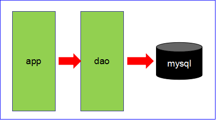
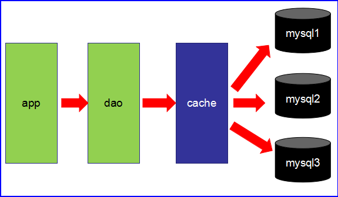
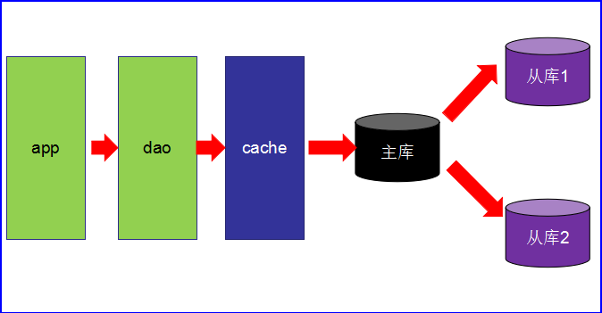
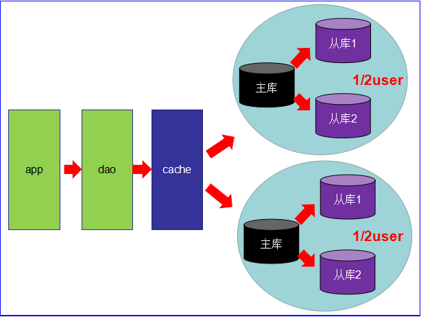
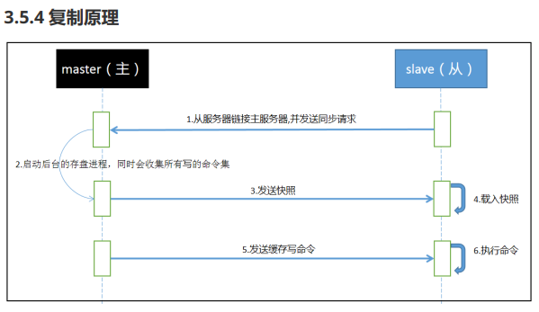

# Redis

# 1. 概述

## 1.1 互联网架构的演变历程

* 第1阶段
    * 数据访问量不大



* 第2阶段
    * 数据访问量大，使用缓存技术
    * 不同业务访问不同的数据库



* 第3阶段
    * 主从读写分离



* 第4阶段
    * MyISAM使用表锁，所以并发性能特别差
    * 分库分表开始流行
    * MySQL集群



## 1.2 Redis入门

* 互联网需求三高：
    * 高并发、高可扩、高性能
* Redis是一种运行速度快、并发能力强，运行在内存上的NoSQL（not only sql）数据库
* 较传统数据库的优势
    * NoSQL不需要事先为存储的数据建立字段，随时可以存储自定义的数据格式
    * 关系型数据库，增删字段是一件非常麻烦的事
* Redis使用场景
    * 缓存
    * 排行榜
    * 计算器/限速器
    * 好友关系
    * 简单消息队列
    * Session共享

## 1.3 Redis/Memcache/MongoDB

* NoSQL数据库的代表

### 1.3.1 Redis和Memcache

* 都是内存数据库，Memcache还可以缓存图片、视频
* Memcache数据结构单一（k-v），Redis提供list、set、hash等数据结构，有效减少网络IO的次数
* 虚拟内存：当Redis物理内存用完时，可以将很久没用到的value交换到磁盘
* 存储数据安全，：Memcache没有持久化机制，Redis定期保存到磁盘
* 灾难恢复：Memcache挂掉后数据不可恢复，Redis可以通过RBD或AOF恢复

### 1.3.2 Redis和MongoDB

* Redis和MongoDB是协作共存的关系

## 1.4 分布式数据库和CAP原理

### 1.4.1 CAP简介

* 传统的关系型数据库具备ACID:
    * A 原子性
    * C 一致性
    * I 独立性
    * D 持久性

* 分布式数据库的CAP：
    * Consistency：强一致性
        * 所有节点在同一时间的数据完全一致
    * Availability：高可用性
        * 服务一直可用
    * Partition tolerance：分区容错性
        * 分布式系统遇到某个节点或网络分区故障，仍然能够对外提供满足一致性和可用性的服务

### 1.4.2 CAP理论

* CAP理论提出是针对分布式数据库环境的，P属性是必须具备的
* 因为P是必须的，需要选择的是A和C

### 1.4.3 CAP总结

* 分区是常态，不可避免，三者不能共存
* 可用性和一致性是互斥的
    * 一致性高，可用性低，一致性低，可用性高
* 根据CAP原理将NoSQL数据库分成满足：
    * CA-单点集群，满足一致性，可用性的系统，通常在可扩展上不太强大
    * CP
    * AP

# 2. Redis的下载和安装

## 2.1 [下载](https://redis.com/)

https://redis.com/

## 2.2 安装

```shell
# 解压
tar zxvf redis*.tar.gz
# 安装gcc
yum -y install gcc
# 进去redis目录编译
make
# 安装目录PREFIX
make install PREFIX=/opt/redis-7.0.5/
# 安装后在 /opt/redis-7.0.5/bin
# 启动redis 
/opt/redis-7.0.5/bin/redis-server

```

## 2.3 操作

### 2.3.1 后台方式运行

```shell
# redis后台启动，修改redis.conf选项为：daemonize yes
# 根据配置文件启动
./redis-server ../redis.conf
```

### 2.3.2 关闭

```shell
# 单实例关闭
redis-cli shutdown
# 多实例关闭
redis-cli -p 6379 shutdown
```

### 2.3.3 常用操作

```shell
# 查看6379端口是否在监听
netstat -lntp|grep 6379
# 检测后台进程是否存在
ps -ef|grep redis
```

### 2.3.4 连接并测试

```shell
./redis-cli
ping
```

### 2.3.5 HelloWorld

```shell
# set key value [NX|XX] [GET] [EX seconds|PX milliseconds|EXAT unix-time-seconds|PXAT unix-time-milliseconds|KEEPTTL]
set k1 china
get k1
```

### 2.3.6 测试性能

```shell
redis-benchmark
# ctrl+c 退出
```

```
  ====== PING_INLINE ======                                                   
  100000 requests completed in 1.32 seconds
  50 parallel clients
  3 bytes payload
  keep alive: 1
  host configuration "save": 3600 1 300 100 60 10000
  host configuration "appendonly": no
  multi-thread: no
  
  Latency by percentile distribution:
  0.000% <= 0.255 milliseconds (cumulative count 9)
  50.000% <= 0.479 milliseconds (cumulative count 51872)
  75.000% <= 0.559 milliseconds (cumulative count 76681)
  87.500% <= 0.599 milliseconds (cumulative count 88033)
  93.750% <= 0.631 milliseconds (cumulative count 95093)
  96.875% <= 0.647 milliseconds (cumulative count 97037)
  98.438% <= 0.671 milliseconds (cumulative count 98459)
  99.219% <= 0.711 milliseconds (cumulative count 99258)
  99.609% <= 0.767 milliseconds (cumulative count 99615)
  99.805% <= 0.879 milliseconds (cumulative count 99807)
  99.902% <= 1.351 milliseconds (cumulative count 99903)
  99.951% <= 1.639 milliseconds (cumulative count 99952)
  99.976% <= 1.783 milliseconds (cumulative count 99976)
  99.988% <= 1.895 milliseconds (cumulative count 99988)
  99.994% <= 1.951 milliseconds (cumulative count 99994)
  99.997% <= 1.975 milliseconds (cumulative count 99997)
  99.998% <= 1.991 milliseconds (cumulative count 99999)
  99.999% <= 2.007 milliseconds (cumulative count 100000)
  100.000% <= 2.007 milliseconds (cumulative count 100000)
  
  Cumulative distribution of latencies:
  0.000% <= 0.103 milliseconds (cumulative count 0)
  3.664% <= 0.303 milliseconds (cumulative count 3664)
  29.324% <= 0.407 milliseconds (cumulative count 29324)
  59.495% <= 0.503 milliseconds (cumulative count 59495)
  90.124% <= 0.607 milliseconds (cumulative count 90124)
  99.169% <= 0.703 milliseconds (cumulative count 99169)
  99.716% <= 0.807 milliseconds (cumulative count 99716)
  99.829% <= 0.903 milliseconds (cumulative count 99829)
  99.881% <= 1.007 milliseconds (cumulative count 99881)
  99.900% <= 1.103 milliseconds (cumulative count 99900)
  99.912% <= 1.407 milliseconds (cumulative count 99912)
  99.926% <= 1.503 milliseconds (cumulative count 99926)
  99.944% <= 1.607 milliseconds (cumulative count 99944)
  99.965% <= 1.703 milliseconds (cumulative count 99965)
  99.977% <= 1.807 milliseconds (cumulative count 99977)
  99.989% <= 1.903 milliseconds (cumulative count 99989)
  100.000% <= 2.007 milliseconds (cumulative count 100000)
  
  Summary:
  throughput summary: 75528.70 requests per second
  latency summary (msec):
  avg       min       p50       p95       p99       max
  0.475     0.248     0.479     0.631     0.695     2.007
```

### 2.3.7 默认16个数据库

```shell
# 配置文件，默认数据库数量16（0-15）
# databases 16
# 切换数据库16
select 15 

```

### 2.3.8 数据库键数量

```shell
redis-cli

dbsize
```

### 2.3.9 清空数据库

```shell
# 当前
flushdb
# 所有
flushall
```

### 2.3.10 模糊查询（key）

```shell
# * 任意数量字符
key *
# ? 单个字符
# [] 某个一个字符
key r[ea]dis

# 查看是哪个数据库默认是0不显示序号
SELECT 1
OK
127.0.0.1:6379[1]> SELECT 0
OK

```

### 2.3.11 键(key)

```shell
# 判断某个键是否存在
exists key
# 移动键到其他库
move key db
# 查看键还有多久过期（-1 永不过期，-2已过期）time to live
ttl key
(integer) -1
# 为键设置过期时间
expire key 秒
# 查看数据类型
type key
string

```

exists k1
(integer) 1 # 存在
exists y1
(integer) 0 # 不存在

# 3. 使用Redis

## 3.1 五大数据类型

命令使用文档：http://redisdoc.com

### 3.1.1 字符串 String

* set/get/del/append/strlen

#### SET

* 将字符串值 value 关联到 key 。
* 如果 key 已经持有其他值， SET 就覆写旧值， 无视类型。
* 当 SET 命令对一个带有生存时间（TTL）的键进行设置之后， 该键原有的 TTL 将被清除。
* NOTE：因为 SET 命令可以通过参数来实现 SETNX 、 SETEX 以及 PSETEX 命令的效果， 所以 Redis 将来的版本可能会移除并废弃 SETNX
  、 SETEX 和 PSETEX 这三个命令。

```shell
# SET key value [EX seconds] [PX milliseconds] [NX|XX]
# EX 过期时间s
SET key-with-expire-time "hello" EX 10086
# PX 过期时间ms
SET key-with-pexpire-time "moto" PX 123321
# NX 键不存在，设置成功
SET not-exists-key "value" NX
SET not-exists-key "new-value" NX
(nil)   # 键已经存在，设置失败
# XX 键存在才设置
SET exists-key "value" XX
(nil)   # 因为键不存在，设置失败
SET exists-key "value"
OK      # 先给键设置一个值
redis> SET exists-key "new-value" XX
OK      # 设置新值成功
```

#### GET

如果键 key 不存在， 那么返回特殊值 nil ； 否则， 返回键 key 的值。
如果键 key 的值并非字符串类型， 那么返回一个错误， 因为 GET 命令只能用于字符串值。

```shell
get key value

DEL db
(integer) 1
LPUSH db redis mongodb mysql
(integer) 3
GET db
(error) ERR Operation against a key holding the wrong kind of value
```

#### GETSET

* 将键 key 的值设为 value， 并返回键 key 在被设置之前的旧值。

```shell
set key 999
GETSET tkey 666
"999"
```

#### STRLEN

* STRLEN 命令返回字符串值的长度。
* 当键 key 不存在时， 命令返回 0 。
* 当 key 储存的不是字符串值时， 返回一个错误

```shell
SET mykey "Hello world"
OK
STRLEN mykey
(integer) 11
STRLEN nonexisting
(integer) 0
```

#### APPEND

* 如果键 key 已经存在并且它的值是一个字符串， APPEND 命令将把 value 追加到键 key 现有值的末尾。
* 如果 key 不存在， APPEND 就简单地将键 key 的值设为 value ， 就像执行 SET key value 一样。
* 返回值：追加 value 之后， 键 key 的值的长度。

```shell

```

#### SETRANGE key offset value

* 从偏移量 offset 开始， 用 value 参数覆写(overwrite)键 key 储存的字符串值。
* 不存在的键 key 当作空白字符串处理。
* 返回值：被修改后字符串值的长度。

```shell

```

#### GETRANGE key start end

* 返回键 key 储存的字符串值的指定部分， 字符串的截取范围由 start 和 end 两个偏移量决定 (包括 start 和 end 在内)。
* 负数偏移量表示从字符串的末尾开始计数， -1 表示最后一个字符， -2 表示倒数第二个字符， 以此类推。
* 返回值：字符串值的指定部分。

```shell
set k 123456789
OK
GETRANGE k 1 3
"234"
```

#### INCR key/DECR

* 为键 key 储存的数字值加上一。
* 如果键 key 不存在， 那么它的值会先被初始化为 0 ， 然后再执行 INCR 命令。
* 如果键 key 储存的值不能被解释为数字， 那么 INCR 命令将返回一个错误。
* 本操作的值限制在 64 位(bit)有符号数字表示之内。
* 返回值 ：INCR 命令会返回键 key 在执行加一操作之后的值。
* NOTE：INCR 命令是一个针对字符串的操作。 因为 Redis 并没有专用的整数类型， 所以键 key 储存的值在执行 INCR 命令时会被解释为十进制
  64 位有符号整数。

```shell
set int 55
OK
INCR int
(integer) 56
```

#### INCRBY key increment/DECRBY key increment

* 为键 key 储存的数字值加上增量 increment 。
* 如果键 key 不存在， 那么键 key 的值会先被初始化为 0 ， 然后再执行 INCRBY 命令。
* 如果键 key 储存的值不能被解释为数字， 那么 INCRBY 命令将返回一个错误。
* 本操作的值限制在 64 位(bit)有符号数字表示之内。

```shell
set int 1
OK
INCRBY int 55
(integer) 56
```

#### INCRBYFLOAT key increment

* 无论是键 key 的值还是增量 increment ， 都可以使用像 2.0e7 、 3e5 、 90e-2 那样的指数符号(exponential notation)来表示， 但是，
  执行 INCRBYFLOAT 命令之后的值总是以同样的形式储存， 也即是， 它们总是由一个数字， 一个（可选的）小数点和一个任意长度的小数部分组成（比如
  3.14 、 69.768 ，诸如此类)， 小数部分尾随的 0 会被移除， 如果可能的话， 命令还会将浮点数转换为整数（比如 3.0 会被保存成 3 ）。
  此外， 无论加法计算所得的浮点数的实际精度有多长， INCRBYFLOAT 命令的计算结果最多只保留小数点的后十七位。
* 当以下任意一个条件发生时， 命令返回一个错误：
    * 键 key 的值不是字符串类型(因为 Redis 中的数字和浮点数都以字符串的形式保存，所以它们都属于字符串类型）；
    * 键 key 当前的值或者给定的增量 increment 不能被解释(parse)为双精度浮点数。

```shell
set float 3.0
OK
INCRBYFLOAT float 5.666
"8.666"
```

#### MSET  key value [key value …]

* 同时为多个键设置值。
* 如果某个给定键已经存在， 那么 MSET 将使用新值去覆盖旧值， 如果这不是你所希望的效果， 请考虑使用 MSETNX 命令，
  这个命令只会在所有给定键都不存在的情况下进行设置。
* MSET 是一个原子性(atomic)操作， 所有给定键都会在同一时间内被设置， 不会出现某些键被设置了但是另一些键没有被设置的情况。

#### MSETNX key value [key value …]

* 当且仅当所有给定键都不存在时， 为所有给定键设置值。
* 即使只有一个给定键已经存在， MSETNX 命令也会拒绝执行对所有键的设置操作。
* MSETNX 是一个原子性(atomic)操作， 所有给定键要么就全部都被设置， 要么就全部都不设置， 不可能出现第三种状态。
* 当所有给定键都设置成功时， 命令返回 1 ； 如果因为某个给定键已经存在而导致设置未能成功执行， 那么命令返回 0 。

##### NOTE：没有setxx/mesetxx命令

#### MGET key [key …]

* 返回给定的一个或多个字符串键的值。
* 如果给定的字符串键里面， 有某个键不存在， 那么这个键的值将以特殊值 nil 表示。
* 返回值：MGET 命令将返回一个列表， 列表中包含了所有给定键的值。

### 3.1.2 列表List

#### LPUSH key value [value …]

* 将一个或多个值 value 插入到列表 key 的表头
* 如果有多个 value 值，那么各个 value 值按从左到右的顺序依次插入到表头： 比如说，对空列表 mylist 执行命令 LPUSH mylist a b
  c ，列表的值将是 c b a ，这等同于原子性地执行 LPUSH mylist a 、 LPUSH mylist b 和 LPUSH mylist c 三个命令。
* 如果 key 不存在，一个空列表会被创建并执行 LPUSH 操作。
* 当 key 存在但不是列表类型时，返回一个错误。
* 列表允许重复元素
* 返回值 ：执行 LPUSH 命令后，列表的长度。

```shell
LPUSH list 1 2 3 4 5 6
(integer) 6
```

#### LPUSHX key value

* 将值 value 插入到列表 key 的**表头**，当且仅当 key 存在并且是一个列表。
* 和 LPUSH key value [value …] 命令相反，当 key **不存在时**， LPUSHX 命令**什么也不做**。

```shell
LLEN greet  # greet 是一个空列表
LPUSHX greet "hello"    # 尝试 LPUSHX，失败，因为列表为空
(integer) 0
LPUSH greet "hello"   # 先用 LPUSH 创建一个有一个元素的列表
(integer) 1
LPUSHX greet "world"  # 这次 LPUSHX 执行成功
(integer) 2
LRANGE greet 0 -1
1) "world"
2) "hello"
```

#### RPUSH key value [value …]

* 将一个或多个值 value 插入到列表 key 的表尾(最右边)。
* 如果有多个 value 值，那么各个 value 值按从左到右的顺序依次插入到表尾：比如对一个空列表 mylist 执行 RPUSH mylist a b c
  ，得出的结果列表为 a b c ，等同于执行命令 RPUSH mylist a 、 RPUSH mylist b 、 RPUSH mylist c 。
* 如果 key 不存在，一个空列表会被创建并执行 RPUSH 操作。
* 当 key 存在但不是列表类型时，返回一个错误。
* 返回值：执行 RPUSH 操作后，表的长度。

```shell
# 添加单个元素
RPUSH languages c
(integer) 1
# 添加重复元素
RPUSH languages c
(integer) 2
LRANGE languages 0 -1 # 列表允许重复元素
1) "c"
2) "c"
# 添加多个元素
RPUSH mylist a b c
(integer) 3
LRANGE mylist 0 -1
1) "a"
2) "b"
3) "c"
```

#### RPUSHX key value

* 将值 value 插入到列表 key 的表尾，当且仅当 key 存在并且是一个列表。
* 和 RPUSH key value [value …] 命令相反，当 key 不存在时， RPUSHX 命令什么也不做

```shell
# key不存在
redis> LLEN greet
(integer) 0
redis> RPUSHX greet "hello"     # 对不存在的 key 进行 RPUSHX，PUSH 失败。
(integer) 0
# key 存在且是一个非空列表
redis> RPUSH greet "hi"         # 先用 RPUSH 插入一个元素
(integer) 1
redis> RPUSHX greet "hello"     # greet 现在是一个列表类型，RPUSHX 操作成功。
(integer) 2
redis> LRANGE greet 0 -1
1) "hi"
2) "hello"
```

##### LPOP key

* 移除并返回列表 key 的头元素。
* 返回值：列表的头元素。 当 key 不存在时，返回 nil 。

```shell
redis> LLEN course
(integer) 0

redis> RPUSH course algorithm001
(integer) 1

redis> RPUSH course c++101
(integer) 2

redis> LPOP course  # 移除头元素
"algorithm001"
```

#### RPOP key

* 移除并返回列表 key 的尾元素。
* 返回值：列表的尾元素。 当 key 不存在时，返回 nil 。

##### RPOPLPUSH source destination

* 命令 RPOPLPUSH 在一个原子时间内，执行以下两个动作：
    * 将列表 source 中的最后一个元素(尾元素)弹出，并返回给客户端。
    * 将 source 弹出的元素插入到列表 destination ，作为 destination 列表的的头元素。
* 返回值：被弹出的元素

#### LREM key count value

* 根据参数 count 的值，移除列表中与参数 value 相等的元素。
    * count 的值可以是以下几种：
        * count > 0 : 从表头开始向表尾搜索，移除与 value 相等的元素，数量为 count 。
        * count < 0 : 从表尾开始向表头搜索，移除与 value 相等的元素，数量为 count 的绝对值。
        * count = 0 : 移除表中所有与 value 相等的值。
* 返回值：被移除元素的数量。 因为不存在的 key 被视作空表(empty list)，所以当 key 不存在时， LREM 命令总是返回 0 。

#### LLEN key

* 返回列表 key 的长度。
    * 如果 key 不存在，则 key 被解释为一个空列表，返回 0 .
    * 如果 key 不是列表类型，返回一个错误。

#### LINDEX key index

* 返回列表 key 中，下标为 index 的元素。

#### LINSERT key BEFORE|AFTER pivot value

* 将值 value 插入到列表 key 当中，位于值 pivot 之前或之后。

#### LSET key index value

* 将列表 key 下标为 index 的元素的值设置为 value 。
* 当 index 参数超出范围，或对一个空列表( key 不存在)进行 LSET 时，返回一个错误
* 操作成功返回 ok ，否则返回错误信息。

#### LRANGE key start stop

* 返回列表 key 中指定区间内的元素，区间以偏移量 start 和 stop 指定

#### LTRIM key start stop

* 对一个列表进行修剪(trim)，就是说，让列表只*保留指定区间内的元素*，不在指定区间之内的元素都将被删除。

#### BLPOP key [key …] timeout

http://redisdoc.com/list/blpop.html

* BLPOP 是列表的阻塞式(blocking)弹出原语。
* 它是 LPOP key 命令的阻塞版本，当给定列表内没有任何元素可供弹出的时候，连接将被 BLPOP 命令阻塞，直到等待超时或发现可弹出元素为止。
* 当给定多个 key 参数时，按参数 key 的先后顺序依次检查各个列表，弹出第一个非空列表的头元素。

##### 非阻塞行为

    当 BLPOP 被调用时，如果给定 key 内至少有一个非空列表，那么弹出遇到的第一个非空列表的头元素，并和被弹出元素所属的列表的名字一起，组成结果返回给调用者。
    当存在多个给定 key 时， BLPOP 按给定 key 参数排列的先后顺序，依次检查各个列表。  
    假设现在有 job 、 command 和 request 三个列表，其中 job 不存在， command 和 request 都持有非空列表。
    考虑以下命令：  
       BLPOP job command request 0  
    BLPOP 保证返回的元素来自 command ，因为它是按”查找 job -> 查找 command -> 查找 request “这样的顺序，第一个找到的非空列表。

```shell
del job command request
(integer) 0
LPUSH command "update system..."
(integer) 1
LPUSH request "visit page"
(integer) 1
BLPOP job command request 0   # job 列表为空，被跳过，紧接着 command 列表的第一个元素被弹出。
1) "command"                  # 弹出元素所属的列表
2) "update system..."         # 弹出元素所属的值
```

##### 阻塞行为

    如果所有给定 key 都不存在或包含空列表，那么 BLPOP 命令将阻塞连接，直到等待超时，或有另一个客户端对给定 key 的任意一个执行 LPUSH key value [value …] 或 RPUSH key value [value …] 命令为止。
    超时参数 timeout 接受一个以秒为单位的数字作为值。超时参数设为 0 表示阻塞时间可以无限期延长(block indefinitely) 。

#### BRPOP key [key …] timeout

#### BRPOPLPUSH source destination timeout

    BRPOPLPUSH 是 RPOPLPUSH source destination 的阻塞版本，当给定列表 source 不为空时， BRPOPLPUSH 的表现和 RPOPLPUSH source destination 一样。
    当列表 source 为空时， BRPOPLPUSH 命令将阻塞连接，直到等待超时，或有另一个客户端对 source 执行 LPUSH key value [value …] 或 RPUSH key value [value …] 命令为止。
    超时参数 timeout 接受一个以秒为单位的数字作为值。超时参数设为 0 表示阻塞时间可以无限期延长(block indefinitely) 。
    更多相关信息，请参考 RPOPLPUSH source destination 命令。
    返回值    
    假如在指定时间内没有任何元素被弹出，则返回一个 nil 和等待时长。 反之，返回一个含有两个元素的列表，第一个元素是被弹出元素的值，第二个元素是等待时长。

### 3.1.3 集合Set

#### SADD key member [member …]

#### SISMEMBER key member

#### SPOP key

* 移除并返回集合中的一个随机元素。
* 如果只想获取一个随机元素，但不想该元素从集合中被移除的话，可以使用 SRANDMEMBER key [count] 命令。

#### SRANDMEMBER key [count]

    SRANDMEMBER key：返回集合中的一个随机元素。
    SRANDMEMBER key count
      从 Redis 2.6 版本开始， SRANDMEMBER 命令接受可选的 count 参数：      
          如果 count 为正数，且小于集合基数，那么命令返回一个包含 count 个元素的数组，数组中的元素各不相同。如果 count 大于等于集合基数，那么返回整个集合。
          如果 count 为负数，那么命令返回一个数组，数组中的元素可能会重复出现多次，而数组的长度为 count 的绝对值。      
      该操作和 SPOP key 相似，但 SPOP key 将随机元素从集合中移除并返回，而 SRANDMEMBER 则仅仅返回随机元素，而不对集合进行任何改动。  

#### SREM key member [member …]

* 移除集合 key 中的一个或多个 member 元素，不存在的 member 元素会被忽略。

#### SMOVE source destination member

* 将 member 元素从 source 集合移动到 destination 集合。SMOVE 是原子性操作。

#### SCARD key

* 返回集合 key 的基数(集合中元素的数量)。

#### SMEMBERS key

* 返回集合 key 中的所有成员。

#### SSCAN key cursor [MATCH pattern] [COUNT count]

* 数据库的操作

#### SINTER key [key …]

* 交集

#### SUNION key [key …]

* 并集

#### SDIFF key [key …]

* 差集

#### SINTERSTORE destination key [key …]

* 这个命令类似于 SINTER key [key …] 命令，但它将结果保存到 destination 集合，而不是简单地返回结果集。
* 如果 destination 集合已经存在，则将其覆盖。
* destination 可以是 key 本身。

#### SUNIONSTORE destination key [key …]

* 这个命令类似于 SUNION key [key …] 命令，但它将结果保存到 destination 集合，而不是简单地返回结果集。
* 如果 destination 已经存在，则将其覆盖。
* destination 可以是 key 本身。

#### SDIFFSTORE destination key [key …]

* 这个命令的作用和 SDIFF key [key …] 类似，但它将结果保存到 destination 集合，而不是简单地返回结果集。
* 如果 destination 集合已经存在，则将其覆盖。
* destination 可以是 key 本身。

### 3.1.4 有序集合Zset

#### ZADD key score member [[score member] [score member] …]

    将一个或多个 member 元素及其 score 值加入到有序集 key 当中。
    如果某个 member 已经是有序集的成员，那么更新这个 member 的 score 值，并通过重新插入这个 member 元素，来保证该 member 在正确的位置上。
    score 值可以是整数值或双精度浮点数。

* 返回值：被成功添加的新成员的数量，不包括那些被更新的、已经存在的成员。

#### ZSCORE key member

* 返回有序集 key 中，成员 member 的 score 值。

#### ZINCRBY key increment member

* 为有序集 key 的成员 member 的 score 值加上增量 increment 。
* 可以通过传递一个负数值 increment ，让 score 减去相应的值，比如 ZINCRBY key -5 member ，就是让 member 的 score 值减去 5 。
* 当 key 不存在，或 member 不是 key 的成员时， ZINCRBY key increment member 等同于 ZADD key increment member 。

#### ZCARD key

* 返回有序集 key 的基数（元素个数）。

#### ZCOUNT key min max

* 返回有序集 key 中， score 值在 min 和 max 之间(默认包括 score 值等于 min 或 max )的成员的数量。
* 返回值：score 值在 min 和 max 之间的成员的数量。

#### ZRANGE key start stop [WITHSCORES]

    返回有序集 key 中，指定区间内的成员。
    其中成员的位置按 score 值递增(从小到大)来排序。
    具有相同 score 值的成员按字典序(lexicographical order )来排列。

#### ZREVRANGE key start stop [WITHSCORES]

* 返回有序集 key 中，指定区间内的成员，按 score 值递减来排序

#### ZRANGEBYSCORE key min max [WITHSCORES] [LIMIT offset count]

#### ZREVRANGEBYSCORE key max min [WITHSCORES] [LIMIT offset count]

#### ZRANK key member

* 返回有序集 key 中成员 member 的排名。其中有序集成员按 score 值递增(从小到大)顺序排列。
* 排名以 0 为底，也就是说， score 值最小的成员排名为 0

#### ZREVRANK key member

#### ZREM key member [member …]

#### ZREMRANGEBYRANK key start stop

#### ZREMRANGEBYSCORE key min max

#### ZRANGEBYLEX key min max [LIMIT offset count]

当有序集合的所有成员都具有相同的分值时， 有序集合的元素会根据成员的字典序（lexicographical ordering）来进行排序，
而这个命令则可以返回给定的有序集合键 key 中， 值介于 min 和 max 之间的成员。
如果有序集合里面的成员带有不同的分值， 那么命令返回的结果是未指定的（unspecified）。
命令会使用 C 语言的 memcmp() 函数， 对集合中的每个成员进行逐个字节的对比（byte-by-byte compare）， 并按照从低到高的顺序，
返回排序后的集合成员。 如果两个字符串有一部分内容是相同的话， 那么命令会认为较长的字符串比较短的字符串要大。
可选的 LIMIT offset count 参数用于获取指定范围内的匹配元素 （就像 SQL 中的 SELECT LIMIT offset count 语句）。 需要注意的一点是，
如果 offset 参数的值非常大的话， 那么命令在返回结果之前， 需要先遍历至 offset 所指定的位置， 这个操作会为命令加上最多 O(N)
复杂度。
如何指定范围区间
合法的 min 和 max 参数必须包含 ( 或者 [ ， 其中 ( 表示开区间（指定的值不会被包含在范围之内）， 而 [ 则表示闭区间（指定的值会被包含在范围之内）。
特殊值 + 和 - 在 min 参数以及 max 参数中具有特殊的意义， 其中 + 表示正无限， 而 - 表示负无限。 因此， 向一个所有成员的分值都相同的有序集合发送命令
ZRANGEBYLEX <zset> - + ， 命令将返回有序集合中的所有元素。
返回值
数组回复：一个列表，列表里面包含了有序集合在指定范围内的成员。

#### ZLEXCOUNT key min max

* 对于一个所有成员的分值都相同的有序集合键 key 来说， 这个命令会返回该集合中， 成员介于 min 和 max 范围内的元素数量。

#### ZREMRANGEBYLEX key min max

* 对于一个所有成员的分值都相同的有序集合键 key 来说， 这个命令会移除该集合中， 成员介于 min 和 max 范围内的所有元素。
* 这个命令的 min 参数和 max 参数的意义和 ZRANGEBYLEX key min max [LIMIT offset count] 命令的 min 参数和 max 参数的意义一样。

#### ZSCAN key cursor [MATCH pattern] [COUNT count]

#### ZUNIONSTORE destination numkeys key [key …] [WEIGHTS weight [weight …]] [AGGREGATE SUM|MIN|MAX]

#### ZINTERSTORE destination numkeys key [key …] [WEIGHTS weight [weight …]] [AGGREGATE SUM|MIN|MAX]

### 3.1.5 哈希Hash

#### HSET hash field value

* 将哈希表 hash 中域 field 的值设置为 value 。

```shell
redis> HSET website google "www.g.cn"
(integer) 1

redis> HGET website google
"www.g.cn"
```

#### HSETNX hash field value

* 当且仅当域 field 尚未存在于哈希表的情况下， 将它的值设置为 value 。
* 如果给定域已经存在于哈希表当中， 那么命令将放弃执行设置操作。

#### HGET hash field

#### HEXISTS hash field

#### HDEL key field [field …]

* 删除哈希表 key 中的一个或多个指定域，不存在的域将被忽略。

#### HLEN

* HLEN key

#### HSTRLEN key field

* 返回哈希表 key 中， 与给定域 field 相关联的值的字符串长度（string length）。
* 如果给定的键或者域不存在， 那么命令返回 0

#### HINCRBY key field increment

    为哈希表 key 中的域 field 的值加上增量 increment 。    
    增量也可以为负数，相当于对给定域进行减法操作。    
    如果 key 不存在，一个新的哈希表被创建并执行 HINCRBY 命令。    
    如果域 field 不存在，那么在执行命令前，域的值被初始化为 0 。    
    对一个储存字符串值的域 field 执行 HINCRBY 命令将造成一个错误。    
    本操作的值被限制在 64 位(bit)有符号数字表示之内。

#### HINCRBYFLOAT key field increment

#### HMSET key field value [field value …]

* 同时将多个 field-value (域-值)对设置到哈希表 key 中。

#### HMGET key field [field …]

#### HKEYS key

* 返回值：一个包含哈希表中所有域的表。

#### HVALS key

* 返回值： 一个包含哈希表中所有值的表

#### HGETALL key

* 以列表形式返回哈希表的域和域的值
* 返回哈希表 key 中，所有的域和值。
* 在返回值里，紧跟每个域名(field name)之后是域的值(value)，所以返回值的长度是哈希表大小的两倍。

#### HSCAN key cursor [MATCH pattern] [COUNT count]

* 数据库相关操作

## 3.2 持久化

### 3.2.1 RDB

* Redis DataBase
    * 在指定时间间隔内，将数据集的快照写入磁盘
    * 默认保存在/usr/local/bin，文件名dump.rdb

#### 3.2.1.1 自动备份

1. redis.conf设置备份策略：save 900 1 # 900秒内，至少变更1次，才会自动备份

#### 3.2.1.2 手动备份

* 每次操作完成，执行命令 save 就会立刻备份

#### 3.2.1.3 与RDB相关的配置

* stop-writes-on-bgsave-error
    * yes 当后台备份时候反生错误，前台停止写入
    * no：不管死活，就是往里怼
* rdbcompression：对于存储到磁盘中的快照，是否启动LZF压缩算法，一般都会启动
* rdbchecksum：在存储快照后，是否启动CRC64算法进行数据校验；
* dbfilename：快照备份文件名字
* dir：快照备份文件保存的目录，默认为当前目录

* 优势and劣势
    * 优：适合大规模数据恢复，对数据完整性和一致行要求不高；
    * 劣：一定间隔备份一次，意外down掉，就失去最后一次快照的所有修改

### 3.2.2 AOF（Append Only File）

* 以日志的形式记录每个写操作；
* 将redis执行过的写指令全部记录下来（读操作不记录）；
* 只许追加文件，不可以改写文件；
* redis在启动之初会读取该文件从头到尾执行一遍，这样来重新构建数据；

#### 3.2.2.1 开启AOF

```
appendonly yes
appendfilename appendonly.aof
```

##### AOF优先载入来恢复原始数据！因为AOF比RDB数据保存的完整性更高！

修复AOF文件，杀光不符合redis语法规范的代码

```
reids-check-aof --fix appendonly.aof
```

#### 3.2.2.3 与AOF相关的配置

    appendonly：开启aof模式
    appendfilename：aof的文件名字，最好别改！
    appendfsync：追写策略
    always：每次数据变更，就会立即记录到磁盘，性能较差，但数据完整性好
    everysec：默认设置，异步操作，每秒记录，如果一秒内宕机，会有数据丢失
    no：不追写
    no-appendfsync-on-rewrite：重写时是否运用Appendfsync追写策略；用默认no即可，保证数据安全性。
    AOF采用文件追加的方式，文件会越来越大，为了解决这个问题，增加了重写机制，redis会
    自动记录上一次AOF文件的大小，当AOF文件大小达到预先设定的大小时，redis就会启动
    AOF文件进行内容压缩，只保留可以恢复数据的最小指令集合
    auto-aof-rewrite-percentage：如果AOF文件大小已经超过原来的100%，也就是一倍，才重写压缩
    auto-aof-rewrite-min-size：如果AOF文件已经超过了64mb，才重写压缩

## 3.3 事务

```shell
multi(begin)
exec(commit) 
discard(rollback)
```

### 3.3.5 watch监控

```shell
watch key
unwatch
```

## 3.4 Redis的发布订阅

终端1：

```shell
SUBSCRIBE cctv1 cctv2 cctv3
Reading messages... (press Ctrl-C to quit)
1) "subscribe"
2) "cctv1"
3) (integer) 1
1) "subscribe"
2) "cctv2"
3) (integer) 2
1) "subscribe"
2) "cctv3"
3) (integer) 3
1) "message" # 接收的发布者发布的信息
2) "cctv3"
3) "hello redis"
```

终端2：

```shell
PUBLISH cctv3 "hello redis"
(integer) 1
```

## 3.5 主从复制

* Redis的集群策略：主从复制
* 配从库，不配主库
* 读写分离：主机写，从机读

### 3.5.1 一主二仆

```shell
# 修改3台服务器中的redis.conf
bind 0.0.0.0
# 查看角色信息
info replication

# 机器1
mset k1 v1 k2 v2
# 机器2,3
slaveof 主机1ip 6379
```

### 3.5.2 血脉相传

* 一个主机理论上可以多个从机，但是这样的话，这个主机会很累
* 可以使用java面向对象继承中的传递性来解决这个问题，减轻主机的负担

```shell
主机1 slaveof 主机2
主机1 slaveof 主机3
```

### 3.5.3 谋权篡位

* 1个主机，2个从机，当1个主机挂掉了，只能从2个从机中再次选1个主机
* 手动选老大
* 1为master，2和3为slave，当1挂掉后，2篡权（slaveof no one）为master，3跟2（slaveof 2）

### 3.5.4 复制原理


完成上面几个步骤后就完成了从服务器数据初始化的所有操作，从服务器此时可以接收来自用户的读请求

* 全量复制：Slave初始化阶段，这时Slave需要将Master上的所有数据都复制一份slave接收到数据文件后，存盘，并加载到内存中；（步骤1234）
* 增量复制：Slave初始化后，开始正常工作时主服务器发生的写操作同步到从服务器的过程；（步骤56）
    * 只要是重新连接master，一次性（全量复制）同步将自动执行
* Redis主从同步策略：主从刚刚连接的时候，进行全量同步；全同步结束后，进行增量同步。
* 如果有需要，slave 在任何时候都可以发起全量同步
* redis 策略是，无论如何，首先会尝试进行增量同步，如不成功，要求从机进行全量同步

### 3.5.5 哨兵模式

* 自动谋权篡位
* Sentinel是Redis的高可用性解决方案：
    * 由一个或多个Sentinel实例组成的Sentinel系统可以监视任意多个**主服务器**，以及所有从服务
      器，并在被监视的主服务器进入下线状态时，自动将下线主服务器属下的某个从服务器升级
      为新的主服务器，然后由新的主服务器代替已下线的主服务器继续处理命令请求

#### 模拟测试

1. 1主，2、3从
2. 每台服务器创建一个配置文件sentinel.conf

```
# sentinel monitor 被监控主机名（自定义） ip port 票数
sentinel monitor 本机名 本机ip 6379 1
```

3. 依次启动3台服务器redis服务：主redis -> 从redis -> sentinel1/2/3
4. 将1号老大挂掉，后台选出新的master
5. 查看最后权限分配，3成为老大
6. 1再次启动，过一段时间自动加入集群，只能作为slave

### 3.5.6 哨兵模式缺点

由于写操作都是在master上完成，再同步到slave，所有两台机器之间通信会有延迟，
当系统繁忙时，延迟问题加重，slave机器增加也会加重

## 3.7 Jedis

* Java和Redis打交道的API客户端

```xml

<dependency>
    <groupId>redis.clients</groupId>
    <artifactId>jedis</artifactId>
    <version>3.1.0</version>
</dependency>
```

```java
public class JedisDemo {

    /**
     *  1.运行前关闭防火墙
     *  2.修改redis.conf：bind 0.0.0.0 （允许任何ip访问）
     *  redis-server redis.conf
     *  redis-cli -p 6379
     * @param args
     */
    public static void main(String[] args) {
        Jedis jedis = new Jedis("redis ip", 6379);
        String pong = jedis.ping();
        // PONG
        System.out.println(pong);

    }
}
```

### 3.8.3 实现分布式锁的思路

1. redis是单线程的，所以命令具备原子性，使用setnx命令实现锁，保存k-v
    * 如果k不存在，保存（当前线程加锁），执行完成后，删除k表示释放锁
    * 如果k存在，阻塞线程执行，表示有锁
2. 如果加锁成功，在执行业务代码的过程中出现异常，导致没有删除k（释放锁失败），就会造成死锁（后面所有线程都无法执行）
    * 设置过期时间，例如10s后自动删除
3. 高并发下，由于时间对等因素导致服务器压力过大或过小，每个线程执行的时间不同
    * 第一个线程执行需要13s，到第10s时，k自动过期（释放锁）
    * 第二个线程执行需要7s，加锁，执行3s（锁被释放，第一个线程finally主动删除释放）
    * ...连锁反映，当前线程刚加的锁，就被其他线程释放掉了，周而复始，导致锁永久失效
4. 给每个线程加上唯一的标识符UUID随机生成，释放的时候判断是否是当前的标识即可
5. 过期时间如何设定？
    * 太长或太短都不好，可以开启一个定时器线程，当过期时间小于总时间的1/3时，增加总过期时间

### 3.8.4 Redisson

* Redisson是用于Java程序中集成Redis的第三方库
* 是在java.util中常用接口基础上，提供一系列具有**分布式特性**的工具类
* 实现分布式锁的方案有很多，zookeeper特点是高可靠性，redis特点是高性能
* 目前分布式锁应用最多的是Redis


# NOTES
  
    如果想在intelliJ中搜索或者查找IP地址，可以用下面的正则表达式。
    \b(?:[0-9]{1,3}.){3}[0-9]{1,3}


